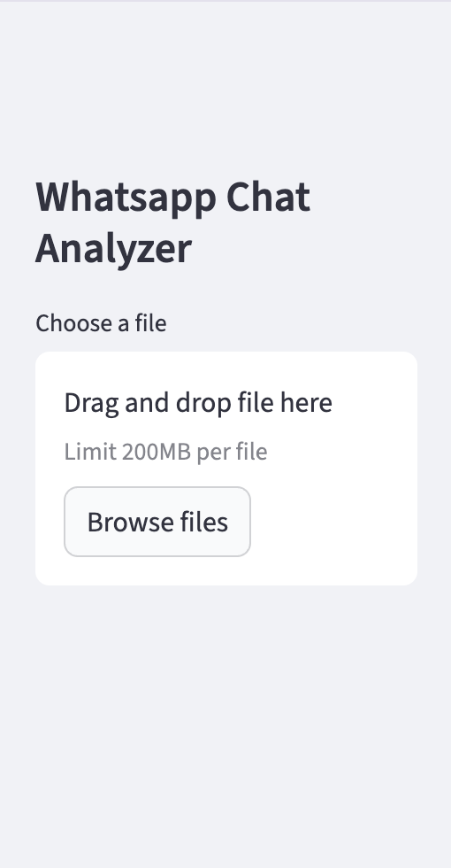
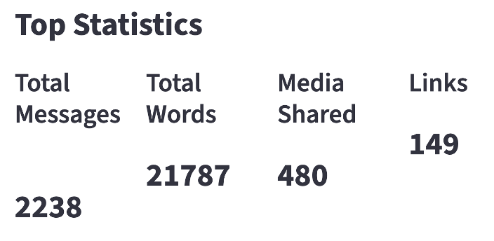
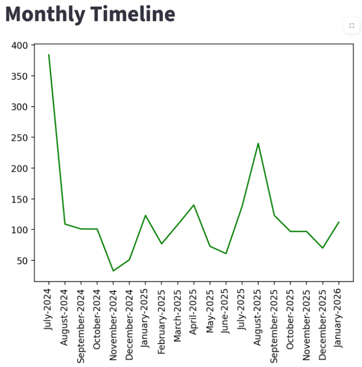
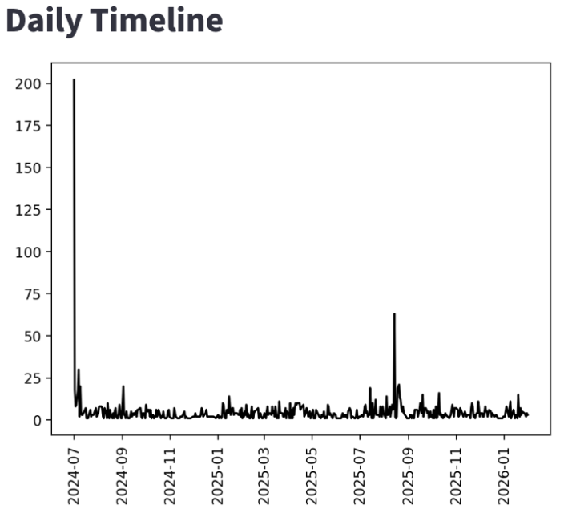
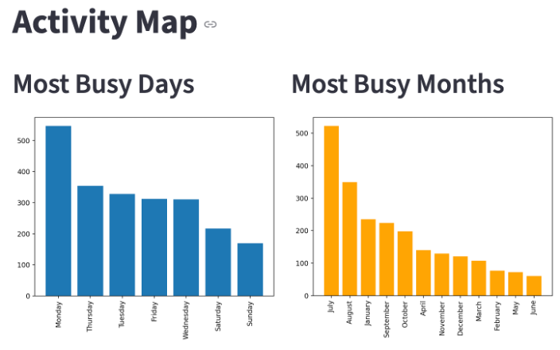
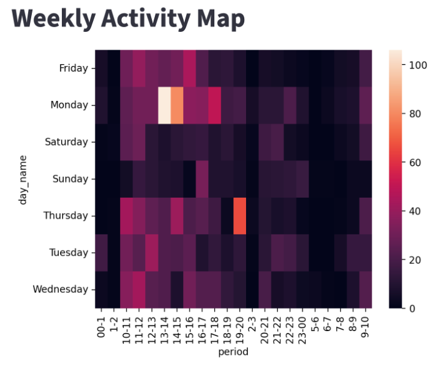
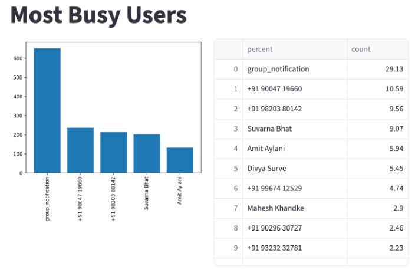
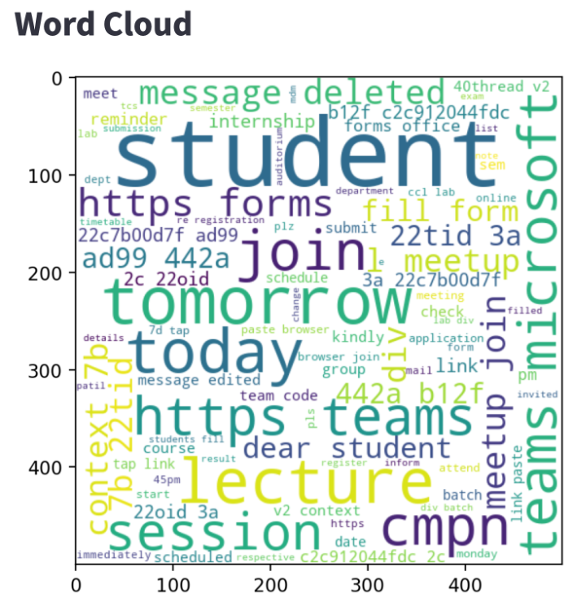
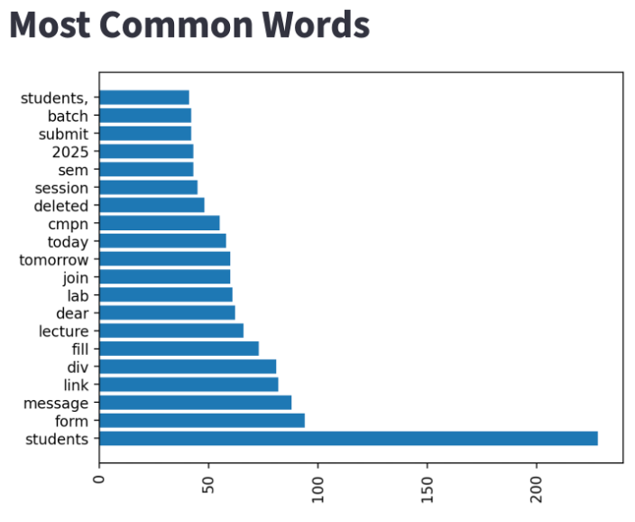
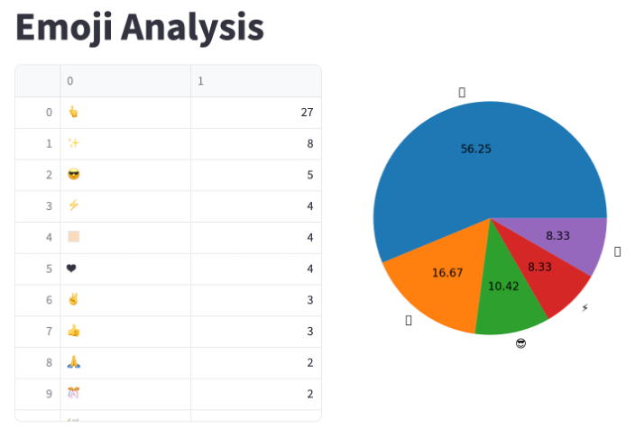

<h1>📊 WhatsApp Chat Analyzer</h1>

A Streamlit-based web application that analyzes exported WhatsApp chat data and provides deep insights using statistics, timelines, activity maps, word clouds, and emoji analysis.

<h2>🚀 Features</h2>

📈 **Top Statistics**

+ Total messages

+ Total words

+ Media shared

+ Links shared

🗓️ **Time-Based Analysis**

+ Monthly timeline

+ Daily timeline

🔥 **Activity Insights**

+ Most busy days

+ Most busy months

+ Weekly activity heatmap

👥 **User Analysis**

+ Most active users

+ Contribution percentage

☁️ **Text Analysis**

+ Word cloud

+ Most common words

😄 **Emoji Analysis**

+ Emoji frequency table

+ Emoji distribution pie chart


<h2>🖥️ App Interface</h2>

**Upload Screen**



**Top Statistics**



**Monthly Timeline**



**Daily Timeline**



**Activity Map**



**Weekly Activity Heatmap**



**Most Busy Users**



**Word Cloud**



**Most Common Words**



**Emoji Analysis**



<h2>🛠️ Tech Stack</h2>

+ Python

+ Streamlit

+ Pandas

+ Matplotlib

+ Seaborn

+ WordCloud

+ URLExtract

<h2>Project Structure</h2>

```
whatsapp-chat-analyzer/
│
├── app.py
├── preprocessor.py
├── helper.py
├── requirements.txt
├── README.md
└── screenshots/
    ├── upload.png
    ├── top_statistics.png
    ├── monthly_timeline.png
    ├── daily_timeline.png
    ├── most_busy_days.png
    ├── most_busy_months.png
    ├── weekly_activity_map.png
    ├── most_busy_users.png
    ├── word_cloud.png
    ├── most_common_words.png
    └── emoji_analysis.png
```

<h2>Installations and Setup</h2>

**Clone the repository**

+ git clone https://github.com/your-username/whatsapp-chat-analyzer.git

+ cd whatsapp-chat-analyzer

**Create virtual environment**

+ python -m venv .venv

+ source .venv/bin/activate  # macOS/Linux

+ .venv\Scripts\activate   # Windows

**Install dependencies**

+ pip install -r requirements.txt

**Run the app**

+ streamlit run app.py

<h2>📤 How to Export WhatsApp Chat</h2>

1. Open WhatsApp chat

2. Click More → Export Chat

3. Choose Without Media

4. Upload the .txt file into the app

<h2>🎯 Use Cases</h2>

+ Academic analysis

+ Group activity insights

+ Social behavior studies

+ NLP and data visualization practice

<h2>🙌 Acknowledgements</h2>

Inspired by WhatsApp data analytics projects and built as part of Machine Learning / Data Analysis coursework.
